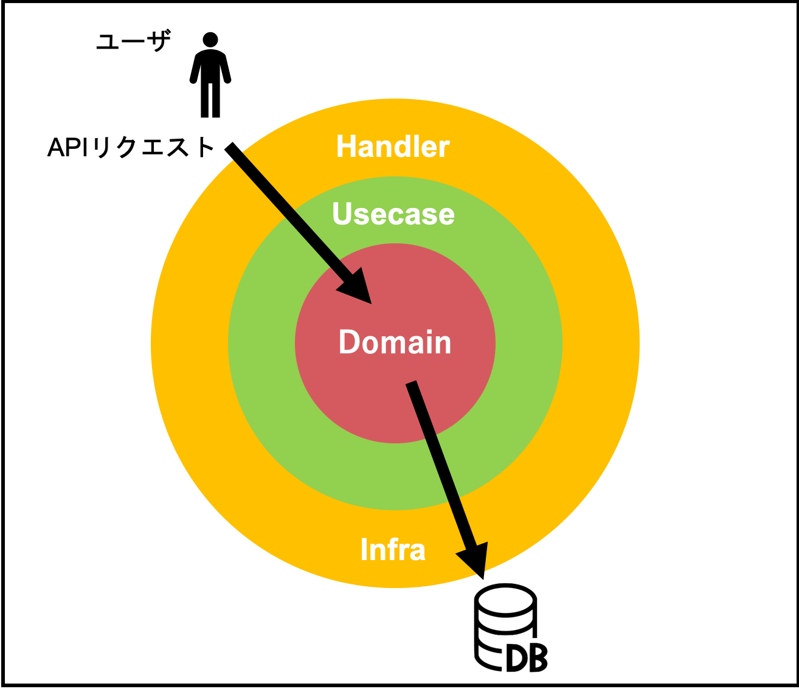

## golangでレイヤードアーキテクチャについて勉強してみた

### 各レイヤのモデルについて(golangに依存した話ではない)

[golangではないですけどモデルの概念は変わらない](https://terasolunaorg.github.io/guideline/public_review/Overview/ApplicationLayering.html#id4)

- **アプリケーション層**
```
情報の入出力となるUIを提供したり、リクエスト情報をドメイン層や、他システムから呼び出し、表示用の出力を返す手続きを行うなど、
アプリケーションを構築するための層である。この層は、できるだけ薄く保たれるべきであり、ビジネスルールを含んではいけない。
```
- **ドメイン層**
```
ドメイン層は、アプリケーションのコアとなる層である。ビジネス上の解決すべき問題を表現し、
ビジネスオブジェクトや、ビジネスルールを含む(口座へ入金する場合に、残高が十分であるかどうかのチェックなど)。
ドメイン層は、他の層からは疎であり、再利用できる。
```
- **インフラストラクチャー層**
```
インフラストラクチャ層では、ドメイン層(Repositoryインタフェース)の実装を提供する。
データストア(RDBMSや、NoSQLなどのデータを格納する場所)への永続化や、メッセージの送信などを担う。
```

[Goでのモデリング](https://www.slideshare.net/pospome/go-80591000)


### レイヤ構造にするメリット

- コードの依存関係を整理できる
- レイヤ間の差し替えが容易になる
- レイヤ内のパッケージの凝集度を高められる

### 実装を行う中での注意点
- レイヤの責務を理解し明確にする　-> ここがシステムの改修基点となるから
  今まではHTTPの`POST`でリクエストしていたものを`PUT`に変わる(hundler起点)

  ```go
  type User struct {
    Name string
    Address string
  }

  ```


  上記の制約を元にして先人の知恵を借り、レイヤードアーキテクチャのモデルを作ってみる

  

### User-Infoを返すAPIを作成してみる

#### 1.Domain層にモデルを作成   

`domain/model/UserInfo.go`

**Domain層はシステムが担うビジネスロジックのモデルを定義** するところである。
今回の場合、ユーザの情報すなわちUserInfoを返したいのでその元となるモデルを作成する。

  ```go
  package model

  import (
    "time"
  )
  type UserInfo (){
    Id    string,
    Name  string,
    Age   int,
    Join  time.time,
  }
  ```
#### 1-2.Domain層にRepositoryを作成   

  `domain/Repository/UserInfo.go`

  リポジトリではDBや[KVS](https://qiita.com/uenohara/items/23eb6ee1259f8a927445)などで行うCRUD処理の定義を行う
  またこのレイヤでは`技術的な関心を持たない`ため、インタフェースの定義のみを行う

  [goのContextについて](https://ayasuda.github.io/pages/what_is_context_at_go.html)

 HTTPレスポンスがタイムアウトした場合などに
 安全にコントールできる仕組みを提供している
 channelよりも簡単に実装できる

  ```go
  package repository
  import(
  "context"
  "github.com/VSN-YK/go-api-server-by-cleanArchitecture/domain/model"

  type UserInfoRepository interface{
    // すべてのユーザ情報を返す関数
    GetAllUserInfo(context.Context)([]*model.UserInfo, error)
  }
)
```

#### 2.Infra層にDomain層で定義したRepositoryの実装を行う

```go
package persistance
import (
  "context"
  "time"

  "github.com/VSN-YK/go-api-server-by-cleanArchitecture/domain/model"

  "github.com/VSN-YK/go-api-server-by-cleanArchitecture/domain/repository"

)

//UserInfoは永続的なデータ構造を持つ
type UserInfoPersistance struct{}

//初期化
func NewUserInfoPersistance () repository.UserInfoRepository{
  return &UserInfoPersistance{}
}

//Repositoryに実装を行う
func (up *UserInfoPersistance) GetAllUserInfo(context.Context)([]*model.UserInfo , error){
  user1 :=model.UserInfo
  user1.Id = "F0001"
  user1.Name = "Kate"
  user1.Age = 20
  user.Join = time.Now().Add(-23 * time.Hour)

  user2 :=model.UserInfo
  user2.Id = "M0001"
  user2.Name = "Jone"
  user2.Age = 20
  user2.Join = time.Now().Add(-23 * 6 * time.Hour)

  return []*model.UserInfo{&user1 , &user2},nil

}
```
#### 3.UseCase(Service)層についての実装

domian層で定義している関数を用いて任意のビジネスロジックを実装を行うレイヤ

```go
package usecase
import (
  "context"

  "github.com/VSN-YK/go-api-server-by-cleanArchitecture/domain/model"
  "github.com/VSN-YK/go-api-server-by-cleanArchitecture/domain/repository"
)

type UserInfoUseCase interface {
  GetAllUserInfo(context.Context)([]*model.UserInfo)
}

type UserInfoCase struct {
  UserInfoRepository repository.UserInfoRepository
}

func NewUserInfoUseCase(ur repository.UserInfoRepository) UserInfoCase{
  return &UserInfoCase{
    UserInfoRepository : ur,
  }
}

func (ur UserInfoUseCase)GetAllUserInfo(ctx context.Context) (usersinfo []*model.UserInfo ,error ){
  //persistance (Repository) 呼び出し
 usersinfo , err = ur.UserInfoRepository.GetAllUserInfo(ctx){
   if err !=nil{
     return nil , err
   }
   return usersinfo , nil
 }
}
```

### 感想

interfaceの基礎的な部分はおさえているが、応用した使い方をマスターしていないため、まだ理解度としては50%程度であると感じました。
そのため先ずは蔑ろになっている基礎がないか
検証を行ったうえで再度デザインパターンに取り組みたいと思いました。

- [比較的わかりやすい参考文献](https://qiita.com/tono-maron/items/345c433b86f74d314c8d)

- [レイヤードアーキテクチャ参考文献](https://yyh-gl.github.io/tech-blog/blog/go_web_api/)
