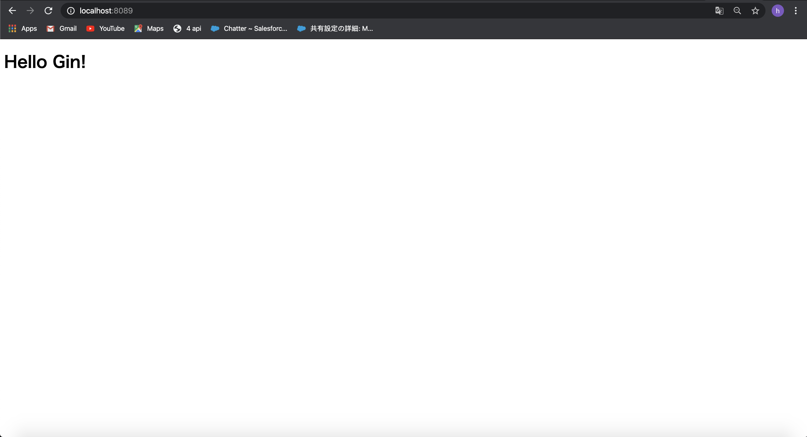

## Ginパーケージ入門

### ginとは...?
```
軽量かつシンプルなインターフェイスがウリの golang のWebアプリケーションフレームワーク
```
### ginの導入について

- パッケージのインストールを行う

  ```sh
  $ cd $GOPATH && go get github.com/gin-gonic/gin
  ```
- webサーバの作成(サーバーサイド)

  ```go
  package main

  import (
      "github.com/gin-gonic/gin"
  )

  func main() {
      router := gin.Default()
      router.LoadHTMLGlob("templates/*.html")

      router.GET("/", func(ctx *gin.Context){
          ctx.HTML(200, "index.html", gin.H{})
      })

      router.Run()
  }
  ```
  

#### 解説ポイント

  - [ ] **ルーティング情報の初期化**

    ルーティング情報の初期化行い、templatesディレクトリ配下にあるhtmlファイルを読み込む
    ```go
    router := gin.Default()
    router.LoadHTMLGlob("templates/*.html")
    ```
  - [ ] **リクエストハンドラーとHTMLのレンダリングを行う**

    リクエストハンドラーの設定を行う。この場合はルートコンテキストパス(`https://localhost:<port>/`)を受け取るとハンドラーが起動され、templatesディレクトリ配下に配置した`index.html`が呼び出される。

    [*gin.Context.HTML()メソッド内部でHTMLのレンダリングを行っていることがわかる](https://github.com/gin-gonic/gin/blob/3315353c20ab224d9308db9df19d83383dba539a/context.go#L852)

    ```go
    router.GET("/", func(ctx *gin.Context){
          ctx.HTML(200, "index.html", gin.H{})
      })

      router.Run()
    ```
  - [ ] **レンダリングを行うHTMLファイル**

    ```HTML
    <!DOCTYPE html>
    <html lang="ja">
    <head>
        <meta charset="UTF-8">
        <title>First Time Gin App</title>
    </head>
    <body>
        <h1>Hello Gin!</h1>
    </body>
    </html>
    ```
  - [ ] **Webサーバを起動するポートを指定**

    ```go
    // 8080
    router.Run()
    //custom
    router.Run(":8089")
    ```

#### 次回からは実際にサンプルWebアプリケーションを作成していきます。
