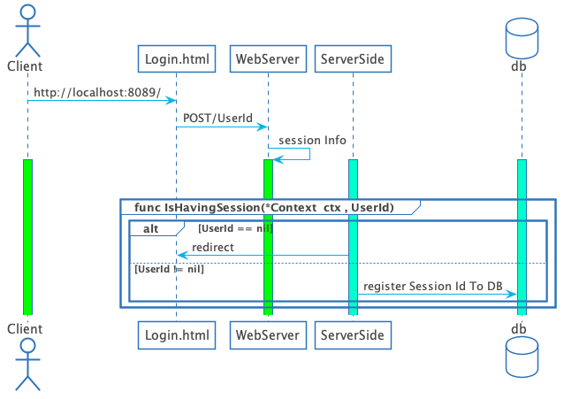

## ginパッケージを用いWeb Appを作成

### 今回作成するアプリケーションの概要

```
localhost:8089/にアクセスを行うとログイン画面(login.html)に遷移を行う。
この場合は初回アクセスとなるため、ユーザに「ユーザID」「ユーザ名」「パスワード」「メール」
の登録を要求する。登録が完了すると登録完了画面(wellcome_member.html)に遷移し、ユーザに
アカウントの登録が完了したことを促す。

次回以降のアクセスについてはcookieにてセッション管理を行う。

注釈 セッション管理の詳細は※1を参照する。
```

#### アプリケーションの概要


#### ※1 セッション管理

- [ ] **1.構成要素について**

<table>
  <tr>
    <th colspan="2"><center>構成要素</center></th>
  </tr>
  <tr>
    <th>パッケージ</th>
    <td>github.com/gin-contrib/sessions<br>github.com/gin-contrib/sessions/cookie</td>
  </tr>
  <tr>
    <th>セッション管理</th>  
    <td>cookie</td>
  </tr>
</table>

- [ ] **2.セッション管理ロジックについて**

  セッション管理のシーケンスフローを下記に示す。`Ex:DBにセッションIDを登録するフロー`

  
