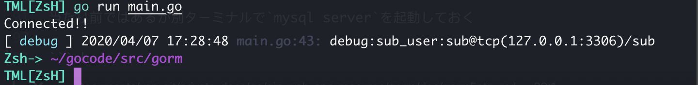

## gormについて

```
goでのORMを提供するパッケージ
```
[参考文献](https://qiita.com/chan-p/items/cf3e007b82cc7fce2d81)

### gormのインストール

```sh
cd $GOPATH && go get github.com/jinzhu/gorm
```

### DB接続を行うサンプルソース
今回は`mysql`を使用するため、[予め必要なパーミッションなどは整備しておく。](https://github.com/VSN-YK/private-docs/blob/master/nodeJs/nodejs_with_basic_of_mysql.md#nodejs%E3%81%A7mysql%E3%81%AB%E6%8E%A5%E7%B6%9A)

### 環境

<table>
  <tr>
    <th colspan = "2">Enviroment</th>
  </tr>
  <tr>
    <th>OS</th>
    <td>Darwin HacknoMacBook-Pro.local 19.3.0 Darwin Kernel Version 19.3.0: Thu Jan  9 20:58:23 PST 2020; root:xnu-6153.81.5~1/RELEASE_X86_64 x86_64</td>
  </tr>
  <tr>
    <th>DB</th>
    <td>mysql: stable 8.0.19 (bottled)</td>
  </tr>
  <tr>
    <th>Service Port</th>
    <td>127.0.0.1:3306</td>
  </tr>

</table>

### mysqlに接続を行うサンプルソース

```go
package main

import (
	"fmt"
	"github.com/comail/colog"
	"github.com/jinzhu/gorm"
	_ "github.com/jinzhu/gorm/dialects/mysql"
	"log"
)

// Set Up in Colog Condition
func setLogCondition() {
	colog.SetDefaultLevel(colog.LDebug)
	colog.SetMinLevel(colog.LTrace)
	colog.SetFormatter(&colog.StdFormatter{
		Colors: true,
		Flag:   log.Ldate | log.Ltime | log.Lshortfile,
	})
	colog.Register()
}

func mysqlConnectWithGorm() (*gorm.DB, string) {
	DBMS := "mysql"
	USER := "sub_user"
	PASS := "sub"
	PROTOCOL := "tcp(127.0.0.1:3306)"
	DBNAME := "sub"

	CONNECT := USER + ":" + PASS + "@" + PROTOCOL + "/" + DBNAME
	db, err := gorm.Open(DBMS, CONNECT)
	if err != nil {
		panic(err.Error())
	}
	db.LogMode(true)
	fmt.Println("Connected!!")
	return db, CONNECT
}

func main() {
	db, connect_str := mysqlConnectWithGorm()
	defer db.Close()
	setLogCondition()
	log.Printf("debug:%s", connect_str)
}
```
接続に成功したかどうかの判定はpanicを返しているかどうか判断できるが、`db.LogMode(true)`
を追記しておく事でDBプロセスのトレースバックが可能になる。

### 接続テスト

当たり前ではあるが別ターミナルで`mysql server`を起動しておく

```sh
$ mysql.server start
Starting MySQL
. SUCCESS!
```

#### main.goを実行
```sh
$ go run main.go
sub_user:sub@tcp(127.0.0.1:3306)/sub
Connected!!
```

